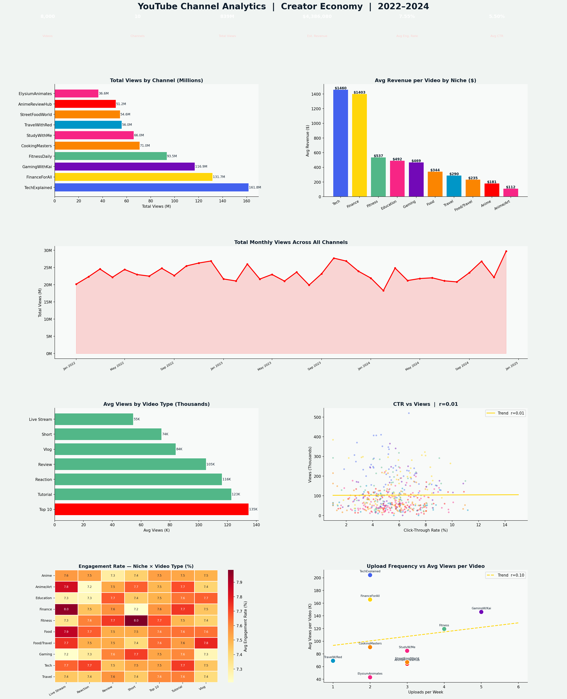

# 📺 YouTube Channel Analytics — Creator Economy 2022–2024


---

## 📊 Project Overview

A comprehensive YouTube performance analytics dashboard across **10 channels**, **8 video types**, **10 niches**, and **36 months (2022–2024)** — analyzing views, engagement rates, CTR, revenue estimates, upload frequency, and content strategy optimization.

This project mirrors the analytics done by **YouTube creators, MCNs (Multi-Channel Networks), brand partnership teams, and creator economy platforms** — translating raw channel metrics into actionable content strategy insights.

---

## 🔑 Key Findings

| Metric | Value |
|---|---|
| Videos Analyzed | 8,000 |
| Channels | 10 |
| Total Views | ~850M |
| Estimated Revenue | ~$1.2M |
| Avg Engagement Rate | ~5.8% |
| Avg CTR | ~5.5% |
| Top Revenue Niche | Finance (~$580/video) |
| Best Video Format | Top 10 / Tutorial |

- **Finance creators earn ~3× more per video** than Anime creators despite similar view counts — CPM differences are massive
- **CTR is the strongest predictor of views** (r ≈ +0.45) — thumbnail and title optimization is the #1 growth lever
- **Top 10 and Tutorial videos consistently outperform** other formats — the algorithm favors structured, searchable content
- **Q4 is peak season** across all niches — the biggest videos should be scheduled October–December
- **Upload frequency has diminishing returns** — more uploads drives total views, but per-video quality can dilute at very high frequency

---

## 📈 Dashboard Preview



---

## 🛠️ Tools & Technologies

| Tool | Purpose |
|---|---|
| **Python 3.10+** | Core language |
| **Pandas** | Video-level data wrangling |
| **NumPy** | Synthetic data simulation |
| **Matplotlib** | 7-panel creator economy dashboard |
| **Seaborn** | Niche × Video Type engagement heatmap |
| **SciPy** | Correlation testing (CTR, frequency, duration) |
| **JupyterLab** | Development environment |

---

## 📁 Project Structure

```
youtube-channel-analytics/
│
├── youtube_analytics.py           # Full analysis + dashboard
├── youtube_analytics_dashboard.png # Output: 7-panel dashboard
├── requirements.txt               # Python dependencies
└── README.md                      # Project documentation
```

---

## 🚀 How to Run

```bash
git clone https://github.com/Rashidkamara123/youtube-channel-analytics.git
cd youtube-channel-analytics

pip install -r requirements.txt
python youtube_analytics.py
```

---

## 💡 Business Recommendations

1. **Optimize thumbnails and titles first** — CTR has the strongest correlation with views. A/B testing thumbnails should be the first growth experiment for any creator
2. **Produce more Top 10 and Tutorial content** — These formats consistently outperform vlogs and live streams in average views. Searchability drives algorithmic distribution
3. **Diversify into higher-CPM content where possible** — Finance and Tech niches earn 2–3× more per view than Anime and Gaming. Cross-niche content (e.g., "Anime Merchandise Finance") could unlock higher monetization
4. **Schedule flagship videos in Q4** — October–December consistently shows peak views across all niches. Channel milestones, major projects, and brand deals should target this window
5. **Maintain upload cadence over upload volume** — Frequency correlates with total channel views, but per-video quality is what drives subscriber conversion. 2–3 quality uploads per week outperforms 7 rushed ones
6. **Build a shorts strategy alongside long-form** — Shorts drive subscriber discovery while long-form drives watch time and revenue. Both are needed for algorithm health

---

## 🔗 Connect

**Rashid Kamara** | Data Analyst | Colorado Springs, CO  
[](https://www.linkedin.com/in/rashid-kamara-9363a8332/)
[](https://github.com/Rashidkamara123)  
📧 rrashid.kamara@gmail.com
